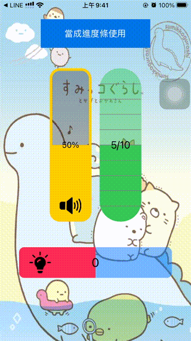
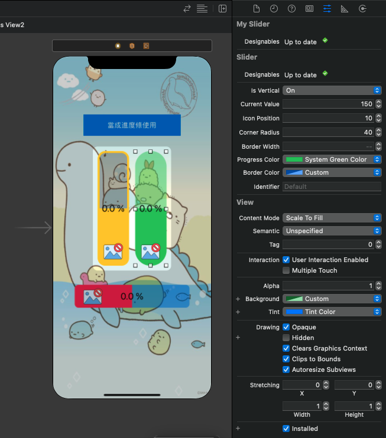

# WWSlider
[](https://developer.apple.com/swift/) [](https://developer.apple.com/swift/) [](https://developer.apple.com/swift/) [](https://developer.apple.com/swift/)

Use UIResponder to imitate an iOS slider.
使用UIResponder仿造一個iOS的滑桿.



### [Installation with Swift Package Manager](https://medium.com/彼得潘的-swift-ios-app-開發問題解答集/使用-spm-安裝第三方套件-xcode-11-新功能-2c4ffcf85b4b)
```
dependencies: [
    .package(url: "https://github.com/William-Weng/WWSlider.git", .upToNextMajor(from: "1.0.0"))
]
```

### Example


```swift
import UIKit
import WWPrint
import WWSlider

@IBDesignable class MySlider: WWSlider {}

final class ViewController: UIViewController {
    
    @IBOutlet weak var myProgressView1: MySlider!
    @IBOutlet weak var myProgressView2: MySlider!
    @IBOutlet weak var myProgressView3: MySlider!

    private let count: UInt = 10
    private let icon: (continuous: UIImage, segmented: UIImage, segmented2: UIImage) = (#imageLiteral(resourceName: "SoundOn"), #imageLiteral(resourceName: "WifiOn"), #imageLiteral(resourceName: "BulbOn"))
    
    private var constant: CGFloat = 0
    
    private enum Identifier: String {
        case continuous = "continuous"
        case segmented = "segmented"
        case segmented2 = "segmented2"
    }
    
    override func viewDidLoad() {
        super.viewDidLoad()
        
        myProgressView1.myDeleagte = self
        myProgressView2.myDeleagte = self
        myProgressView3.myDeleagte = self
        
        myProgressView1.configure(id: "\(Identifier.continuous)", initValue: "50%", font: .systemFont(ofSize: 16), icon: icon.continuous, type: .continuous)
        myProgressView2.configure(id: "\(Identifier.segmented)", initValue: "5/\(count)", font: .systemFont(ofSize: 20), icon: icon.segmented, type: .segmented(count))
        myProgressView3.configure(id: "\(Identifier.segmented2)", initValue: "0", font: .systemFont(ofSize: 24), icon: icon.segmented2, type: .segmented(count))
    }
    
    @IBAction func testPregress(_ sender: UIButton) { progressTest() }
}

// MARK: - ProgressViewDeleagte
extension ViewController: SliderDeleagte {
    
    func valueChange(identifier: String, currentValue: CGFloat, maximumValue: CGFloat, isVertical: Bool) -> SliderDeleagte.SliderInfomation {
        
        guard let identifier = Identifier(rawValue: identifier) else { fatalError() }
        
        switch identifier {
        case .continuous: return continuousTypeInfo(currentValue: currentValue, maximumValue: maximumValue)
        case .segmented: return segmentedTypeInfo(currentValue: currentValue, maximumValue: maximumValue)
        case .segmented2: return segmentedTypeInfo2(currentValue: currentValue, maximumValue: maximumValue)
        }
    }
}

// MARK: - 測試用
extension ViewController {
    
    /// 連續的顯示效果
    private func continuousTypeInfo(currentValue: CGFloat, maximumValue: CGFloat) -> SliderDeleagte.SliderInfomation {
        
        let percentage = Int(currentValue / maximumValue * 100)
        var icon = #imageLiteral(resourceName: "SoundOff")
        
        switch percentage {
        case 31...60: icon = #imageLiteral(resourceName: "SoundOn")
        case 61...: icon = #imageLiteral(resourceName: "SoundFull")
        default: icon = #imageLiteral(resourceName: "SoundOff")
        }
        
        return (text: "\(percentage) %", icon: icon)
    }
    
    /// 分段的顯示效果
    private func segmentedTypeInfo(currentValue: CGFloat, maximumValue: CGFloat) -> SliderDeleagte.SliderInfomation {
        
        let index = Int(currentValue * CGFloat(count) / maximumValue)
        var icon = #imageLiteral(resourceName: "WifiOff")
        
        switch index {
        case 3...6: icon = #imageLiteral(resourceName: "WifiOn")
        case 7...: icon = #imageLiteral(resourceName: "WifiFull")
        default: icon = #imageLiteral(resourceName: "WifiOff")
        }
        
        return (text: "\(index)/\(count)", icon: icon)
    }
    
    /// 分段的顯示效果2
    private func segmentedTypeInfo2(currentValue: CGFloat, maximumValue: CGFloat) -> SliderDeleagte.SliderInfomation {
        
        let level = Int(currentValue * CGFloat(count) / maximumValue) - Int(count) / 2
        var icon = #imageLiteral(resourceName: "WifiOff")
        
        switch level {
        case (-5)...(-2): icon = #imageLiteral(resourceName: "BulbOff")
        case (-1)...2: icon = #imageLiteral(resourceName: "BulbOn")
        default: icon = #imageLiteral(resourceName: "BulbFull")
        }
        
        return (text: "\(level)", icon: icon)
    }
    
    /// 測試設定進度條
    private func progressTest() {
        
        DispatchQueue.main.asyncAfter(deadline: .now() + 1) {
            
            let _ = self.myProgressView1.valueSetting(constant: self.constant, info: (text: "\(self.constant)", icon: self.icon.continuous))
            self.constant += 10
            self.progressTest()
        }
    }
}
```
